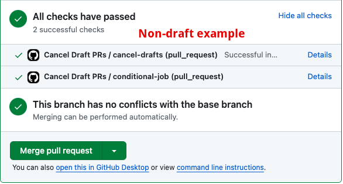
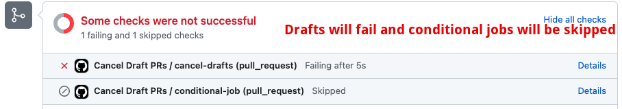
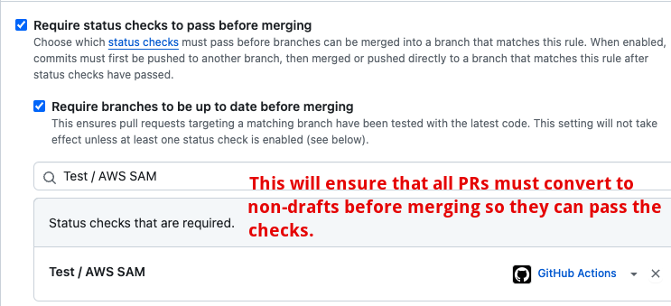

# Cancel Draft PRs - GitHub Action

GitHub Actions doesn't currently allow you to do this pseudocode:

```yaml
on:
  pull_request_non_draft:
```

There are workarounds for this limitation, but they have some drawbacks, as discussed in [this community thread](https://github.com/orgs/community/discussions/25722). 

This action is a workaround for that limitation. It cancels draft PRs. It's useful if you want to skip some steps in your workflow if the PR is a draft. For example, if you only want to deploy to Test environments on non-draft PRs.

# Usage

```yaml
name: Cancel Draft PRs
on:
  pull_request:
    types: [opened, synchronize, reopened, ready_for_review]

jobs:
  cancel-drafts:
    runs-on: ubuntu-latest
    steps:
      - name: Check PR Draft Status and Cancel Workflow
        uses: kmcquade/cancel-draft-prs-action@latest
        with:
          github-token: ${{ secrets.GITHUB_TOKEN }}

  conditional-job:
    needs: cancel-drafts
    runs-on: ubuntu-latest
    steps:
      - name: Run if PR is not a draft
        run: echo "PR is not a draft, running job..."
```

# Example: Non-draft PRs

If you have a non-draft PR, the workflow will run as expected.



# Example: Draft PRs

If you have a draft PR, any jobs that depend on the `cancel-draft-prs` job will be skipped, and the cancel job will show up as failed by design.



# FAQs

## What if someone creates a draft PR and then tries to merge it?

You can prevent this with [branch protection rules](https://docs.github.com/en/repositories/configuring-branches-and-merges-in-your-repository/managing-protected-branches/managing-a-branch-protection-rule). One strategy is to [require status checks](https://docs.github.com/en/pull-requests/collaborating-with-pull-requests/collaborating-on-repositories-with-code-quality-features/about-status-checks) to pass before merging. In the example below, the "AWS SAM" status check is required to pass before merging. However, my action is configured to **not** run on draft PRs. Therefore, you must convert it for a non-draft PR to trigger the test, and then the test must pass.

